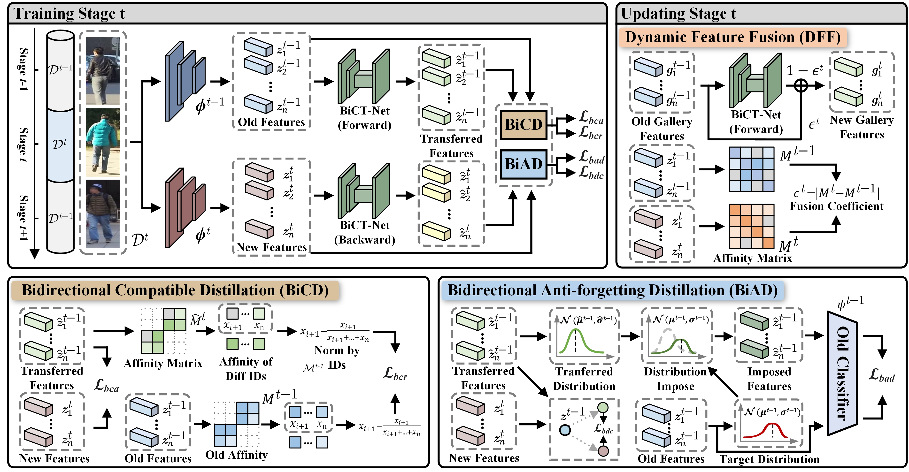
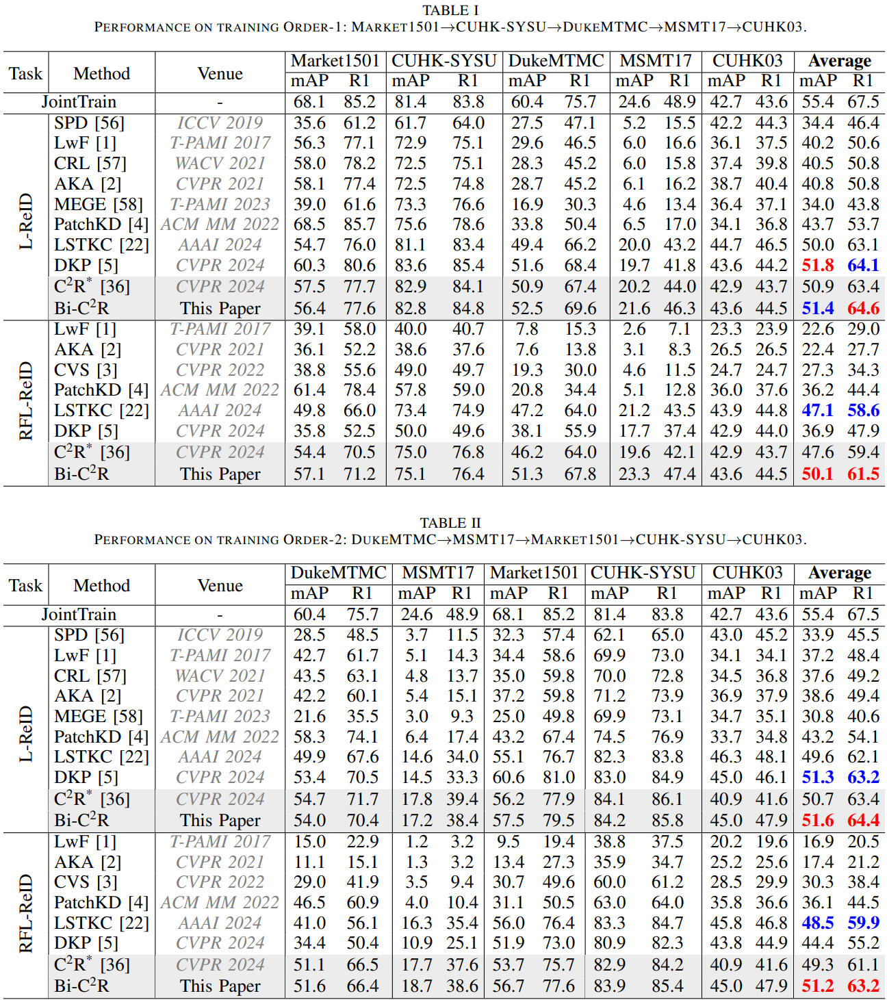

# [TPAMI2026] Bi-C<sup>2</sup>R: Bidirectional Continual Compatible Representation for Re-indexing Free Lifelong Person Re-identification
The *official* repository for Bi-C<sup>2</sup>R: Bidirectional Continual Compatible Representation for Re-indexing Free Lifelong Person Re-identification.



## Installation
```shell
conda create -n IRL python=3.7
conda activate IRL
pip install torch==1.13.1+cu117 torchvision==0.14.1+cu117 torchaudio==0.13.1 --extra-index-url https://download.pytorch.org/whl/cu117
pip install -r requirement.txt
```
## Prepare Datasets
Download the person re-identification datasets [Market-1501](https://drive.google.com/file/d/0B8-rUzbwVRk0c054eEozWG9COHM/view), [MSMT17](http://www.pkuvmc.com/dataset.html), [CUHK03](https://github.com/zhunzhong07/person-re-ranking/tree/master/evaluation/data/CUHK03). Other datasets can be prepared following [Torchreid_Datasets_Doc](https://kaiyangzhou.github.io/deep-person-reid/datasets.html) and [light-reid](https://github.com/wangguanan/light-reid).
Then unzip them and rename them under the directory like
```
PRID
├── CUHK03
│   └──..
├── CUHK-SYSU
│   └──..
├── DukeMTMC-reID
│   └──..
├── MSMT17_V2
│   └──..
├── Market-1501
    └──..
```
## Quick Start
Training + evaluation:
```shell
bash run1.sh
bash run2.sh
```

## Results
The following results were obtained with a single NVIDIA A40 GPU:



## Acknowledgement
Our code is based on the PyTorch implementation of [LSTKC](https://github.com/zhoujiahuan1991/LSTKC), [PatchKD](https://github.com/feifeiobama/PatchKD) and [PTKP](https://github.com/g3956/PTKP).

## Contact

For any questions, feel free to contact us (cuizhenyu@stu.pku.edu.cn).

Welcome to our [Laboratory Homepage](http://www.icst.pku.edu.cn/mipl/home/) for more information about our papers, source codes, and datasets.
